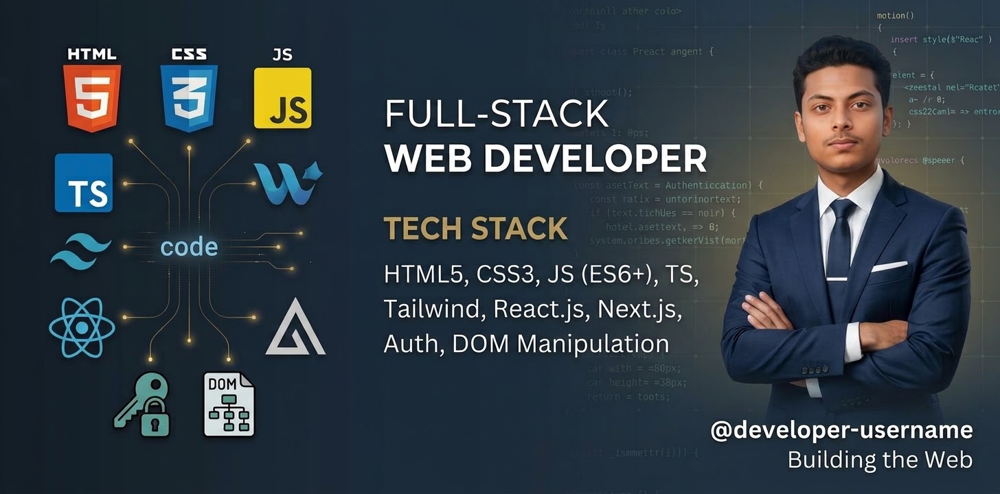

<p align="center">
  
</p>

<p align="center">
  <strong>Frontend Developer from Bangladesh 🇧🇩</strong>
  <br/>
  <sub>Learning • Building • Improving • Repeating</sub>
</p>

---

# 👋 About Me

Hi! I'm **Wakil Ahmed**, a passionate **Frontend Developer from Bangladesh 🇧🇩**.

I'm currently focused on building modern, responsive and user-friendly web applications using **React, Next.js, JavaScript and TypeScript**.

I enjoy turning ideas into real projects, solving programming problems and continuously improving my development skills.

My long-term goal is to become a **professional Full-Stack Developer**.

---

# 🛠️ Technologies I Have Learned

<p align="center">
  
</p>

<p align="center">
  
</p>

<p align="center">
  
</p>

<p align="center">
  <sub>
    HTML5 • CSS3 • Tailwind CSS • JavaScript • TypeScript • React • Next.js
    <br/>
    Git • GitHub • VS Code • Figma • Vercel • Node.js • MongoDB
  </sub>
</p>

---

# 💻 Frontend Development

<p align="center">
  
</p>

### ⚡ What I Can Work With

* 🌐 HTML5 & Semantic HTML
* 🎨 CSS3
* 💨 Tailwind CSS
* 🟨 JavaScript
* 🔷 TypeScript
* ⚛️ React
* ▲ Next.js
* 📱 Responsive Web Design
* 🧩 Reusable Components
* 🔀 Dynamic Routing
* 🔌 REST API Integration
* 📡 Data Fetching
* 🖥️ SSR / CSR
* ⚡ SSG / ISR
* 💧 Hydration
* 🐛 Debugging

---

# 🧰 Tools I Use

<p align="center">
  
</p>

| Tool    | Purpose               |
| ------- | --------------------- |
| Git     | Version Control       |
| GitHub  | Code Hosting          |
| VS Code | Development           |
| Figma   | UI Reference & Design |
| Vercel  | Deployment            |

---

# 🚀 Featured Projects

## 🏋️ FitLog — Workout Library

**FitLog** is a modern dark-themed workout companion built with **Next.js, React, TypeScript and Tailwind CSS**.

Users can browse workouts, explore detailed workout information, create a daily workout plan and save workouts for later.

### ✨ Features

* 🏋️ Workout Library
* 🔎 Detailed Workout Pages
* 📋 Today's Workout Plan
* ❤️ Save for Later
* 📊 Workout Sorting
* ✅ Mark as Done
* 🔢 Workout Statistics
* 🔌 API Data Fetching
* 📱 Responsive Design
* 🎨 Modern Dark UI

### 🛠️ Technologies

<p>
  
</p>

**Live Demo:**
https://b14-a6-fit-log-iota.vercel.app/

**GitHub Repository:**
https://github.com/mdwakil2009/B14-A6-Fit-Log

---

## 💻 DevStack — Technology Stack Builder

**DevStack** is a React-based application where users can explore different technologies and create their own personalized technology stack.

### ✨ Features

* 🧩 Technology Cards
* ➕ Add Technologies
* 🚫 Duplicate Protection
* ❌ Remove Technologies
* 🔔 Toast Notifications
* 📱 Responsive Interface
* ⚡ Fast Vite Development

### 🛠️ Technologies

<p>
  
</p>

**GitHub Repository:**
https://github.com/mdwakil2009/Assignment-05

---

# 📚 Currently Learning

<p align="center">
  
</p>

I'm continuously improving my development skills and currently focusing on:

* 🟨 Advanced JavaScript
* 🔷 TypeScript
* ⚛️ React
* ▲ Next.js
* 🟢 Node.js
* 🍃 MongoDB
* 🔐 Backend Development
* 🔌 API Development
* 🚀 Full-Stack Development

---

# 🔥 Contribution Activity

<p align="center">


</p>

<p align="center">


</p>

---

# 🎯 My Developer Journey

```text
HTML & CSS
     ↓
Tailwind CSS
     ↓
JavaScript
     ↓
TypeScript
     ↓
React
     ↓
Next.js
     ↓
Backend Development
     ↓
Node.js + MongoDB
     ↓
Full-Stack Developer 🚀
```

---

# 🎯 2026 Goals

* [x] Learn HTML & CSS
* [x] Learn Tailwind CSS
* [x] Learn JavaScript Fundamentals
* [x] Learn React Fundamentals
* [x] Learn TypeScript Fundamentals
* [x] Build Real-World Projects
* [x] Learn Next.js Fundamentals
* [ ] Master Advanced JavaScript
* [ ] Become Stronger in TypeScript
* [ ] Master Next.js
* [ ] Learn Node.js & Express
* [ ] Learn MongoDB
* [ ] Build Full-Stack Applications
* [ ] Become a Professional Full-Stack Developer

---

# 🧠 What I Believe

> **"Don't just learn code. Build with it."**

I believe the best way to improve as a developer is to **learn, build, make mistakes, debug, and repeat**.

Every project teaches me something new.

### **Learn • Build • Debug • Improve • Repeat.**

---

# ⚽ Beyond Coding

When I'm not coding, I enjoy:

* ⚽ Playing Football
* 💻 Exploring New Technologies
* 🧠 Learning Programming
* 🚀 Building Personal Projects
* 📚 Improving My English & Communication Skills

---

# 🤝 Connect With Me

<p align="center">

<a href="https://github.com/mdwakil2009">
  
</a>

<a href="https://www.linkedin.com/">
  
</a>

</p>

---

<p align="center">

### 🚀 Keep Learning • Keep Building • Keep Growing

**Thanks for visiting my GitHub profile! ❤️**

</p>

<p align="center">
  
</p>
